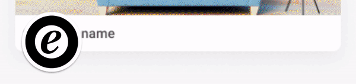
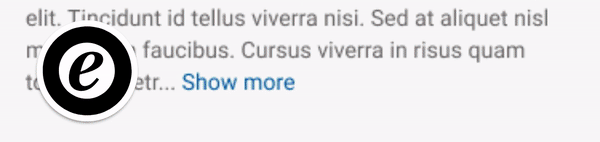
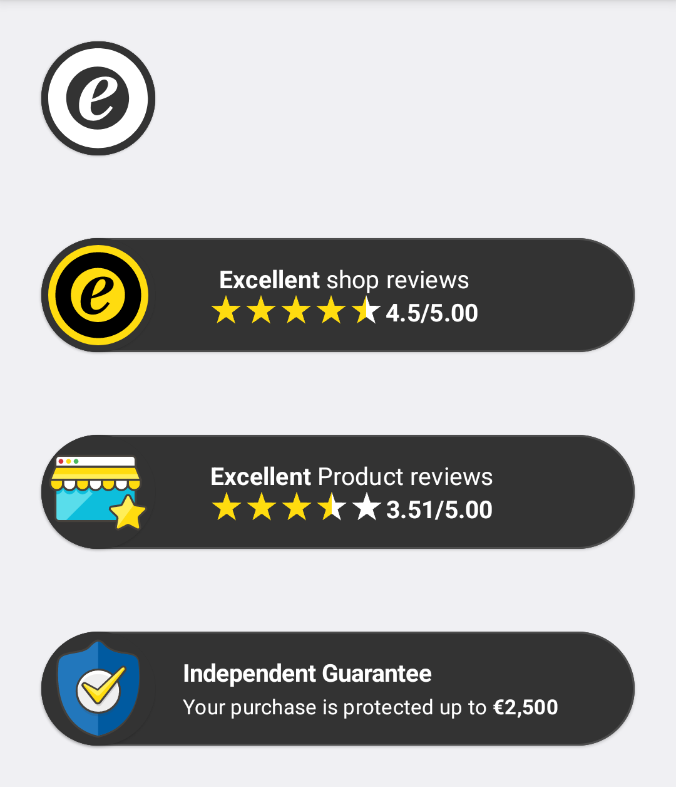

# etrusted-android-trustbadge-library

[](https://github.com/trustedshops-public/etrusted-android-trustbadge-library/blob/main/LICENSE)
[](https://codecov.io/gh/trustedshops-public/etrusted-android-trustbadge-library)
[](https://dl.circleci.com/status-badge/redirect/gh/trustedshops-public/etrusted-android-trustbadge-library/tree/develop)
[](https://sonarcloud.io/summary/new_code?id=trustedshops-public_etrusted-android-trustbadge-library)

> This project is currently work in progress and used only be a few
> customers. APIs might not be stable yet and might change without
> further notice

Show the Trustmark and the Shop Grade widget in your Android app, all in 5 steps!

The `Trustmark` widget shows the validity of your trust certificate by Trusted Shop:


In case of an expired certificate, the Trustmark widgets is presented like the following instead:


The `ShopGrade` widget expands to show shop rating and status with a simple animation. Currently, the widget shows the aggregate rating and the shop status.
In the future, the widget will also show the shop reviews.


The `ProductGrade` widget expands to show product rating with a simple animation. Currently, the widget shows the single product rating for a given `SKU` (See the step: **Implement the dependency**).
In the future, the widget will also show the product reviews.



The `BuyerProtection` widget shows the amount of protection for the consumers' purchase. It can be shown in the checkout screen for that purpose.


## Usage
**Requirements:**
- Access to [eTrusted Control Center](https://app.etrusted.com)
- Your `channelId` and `TSID`
  For more info about how to get `channelId` and `TSID` read the [Getting the `channelId` and `TSID`]() sections (last section in this document).

You can add the Trustbadge widget to your Android project in 2 steps:

1. [🐘 Implement the dependency](#1-🐘-implement-the-dependency)
2. [🚀 Show the widget](#2-🚀-show-the-widget)

### 1. 🐘 Implement the dependency
- In your `app` module's `build.gradle` file, add the following line in your dependencies block:
```kotlin
dependencies {
    implementation("com.etrusted.android.trustbadge.library:(version))")
}
```
- replace (version) with the latest version of the library. (See the releases page).
- Sync the project and make sure it is successful. If it is not, please make sure that the configuration file is placed under project root directory (e.g. not inside the `app` module's directory)

### 2. 🚀 Show the widget:
We recommend using Jetpack Compose to show the widget in your app.

---
#### Jetpack Compose Sample (Fastest):

<br />

Use the Trustbadge Compose function anywhere in your composables:
Example of showing the `ShopGrade` widget:
```kotlin
Trustbadge(
    badgeContext = TrustbadgeContext.ShopGrade,
    tsid = "X330A2E7D449E31E467D2F53A55DDD070",
    channelId = "chl-b309535d-baa0-40df-a977-0b375379a3cc"
)
```


<br />

For `ProductGrade`, it is required to provide the product `sku` as well, that way the widget shows the rating for a product with given `sku`:
```kotlin
Trustbadge(
    badgeContext = TrustbadgeContext.ProductGrade(sku = "1234-Ti-Bl"),
    tsid = "X330A2E7D449E31E467D2F53A55DDD070",
    channelId = "chl-b309535d-baa0-40df-a977-0b375379a3cc"
)
```


<br />

Showing `BuyerProtection` widget, is also similar to the `ShopGrade`:
```kotlin
Trustbadge(
    badgeContext = TrustbadgeContext.BuyerProtection,
    tsid = "X330A2E7D449E31E467D2F53A55DDD070",
    channelId = "chl-b309535d-baa0-40df-a977-0b375379a3cc"
)
```


<br />

Align the badge anywhere in its parent using a standard `Modifier`. For example:
```kotlin
Trustbadge(
    modifier = Modifier.align(Alignment.BottomStart),
    badgeContext = TrustbadgeContext.ShopGrade,
    tsid = "X330A2E7D449E31E467D2F53A55DDD070",
    channelId = "chl-b309535d-baa0-40df-a977-0b375379a3cc"
)
```

<br />

Control hiding or showing the badge using the `TrustbadgeState`:
```kotlin
val badgeState = rememberTrustbadgeState()

Trustbadge(
    state = badgeState,
    badgeContext = TrustbadgeContext.ShopGrade,
    tsid = "X330A2E7D449E31E467D2F53A55DDD070",
    channelId = "chl-b309535d-baa0-40df-a977-0b375379a3cc"
)

// then badgeState can be used in desired events
LaunchedEffect(null) {
    
    // show the badge
    badgeState.show()

    // hide the badge
    badgeState.hide()
}
```

For example, hide the badge when the user scrolls using the badge state and scroll state of a column:
```kotlin
@Composable
internal fun HideBadgeOnScroll(
    scrollState: ScrollState,
    badgeState: TrustbadgeState
) {
    if (scrollState.value == 0) {
        badgeState.show()
    } else {
        LaunchedEffect(null) {
            delay(1000)
            badgeState.hide()
        }
    }
}
```


For full example of hiding the badge when the user scrolls, see [`HomeScreen.kt`](app/src/main/java/com/etrusted/android/trustbadgeexample/ui/home/HomeScreen.kt) in the example app.

<br />

---
#### Legacy XML Sample (Requires more configuration):
Using the Legacy UI system requires more steps to show the widget:

First, add a `ComposeView` tag in your layout's XML file, for example:
```xml
<?xml version="1.0" encoding="utf-8"?>
<LinearLayout
    xmlns:android="http://schemas.android.com/apk/res/android"
    android:orientation="vertical"
    android:layout_width="match_parent"
    android:layout_height="match_parent">

    <androidx.compose.ui.platform.ComposeView
        android:id="@+id/compose_view"
        android:layout_width="match_parent"
        android:layout_height="match_parent" />

</LinearLayout>
```

Then in your source file, inflate the layout and get the `ComposeView` using the XML ID, set a composition strategy that works best for you and call the `setContent()` to use Compose.
Example of loading the Trustbadge in a fragment:
```kotlin
override fun onCreateView(
        inflater: LayoutInflater,
        container: ViewGroup?,
        savedInstanceState: Bundle?
    ): View {
        _binding = FragmentExampleBinding.inflate(inflater, container, false)
        val view = binding.root
        binding.composeView.apply {
            // Dispose of the Composition when the view's LifecycleOwner
            // is destroyed
            setViewCompositionStrategy(ViewCompositionStrategy.DisposeOnViewTreeLifecycleDestroyed)
            setContent {
                // In Compose world
                Trustbadge(
                    badgeContext = TrustbadgeContext.ShopGrade,
                    tsid = "X330A2E7D449E31E467D2F53A55DDD070",
                    channelId = "chl-b309535d-baa0-40df-a977-0b375379a3cc"
                )
            }
        }
        return view
    }
```
For more information about Compose interoperability with the legacy system, please refer to [Android official docs for Interoperability APIs](https://developer.android.com/jetpack/compose/interop/interop-apis).

<br />

### Dark Mode
The Trustbadge Widget now supports Dark Mode on Android.
By default, the widget will follow the system theme.



To override the system theme, you can force the widget to use Dark Mode by wrapping the `Trustbadge` composable in a `TrustbadgeTheme` and setting the `darkTheme` parameter to `true` in the `TrustbadgeTheme`.

Example of overriding the system theme to Dark Mode:
```kotlin
TrustbadgeTheme(darkTheme = true) {
    Trustbadge(...)
}
```

For more information about forcing Dark Mode, please refer to [Android official docs for Force Dark](https://developer.android.com/develop/ui/views/theming/darktheme#force-dark).

<br />

---
Your eTrusted `account` might contain more than one `channel`. The `Trustbadge` function requires a `channelId` to determine which channel it should choose to load the information from your `account`.
Please read the section [Getting `channelId` and `TSID`]() for more information about how to get that information.

The `Trustbadge` function requires a `badgeContext` to determine either showing the `TrustMark`, the `ShopGrade`, or the `BuyerProtection` widget.
You can simply pass either of the following options to set your desired `badgeContext`:

```
- TrustbadgeContext.TrustMark
- TrustbadgeContext.ShopGrade
- TrustbadgeContext.ProductGrade
- TrustbadgeContext.BuyerProtection
```

## Getting `channelId` and `TSID`
- You can find your `channelId` by navigating to your desired channel on [eTrustd Control Center](https://app.etrusted.com) in your browser. You can simply copy the `channelId` from the address bar (starts with `chl-`) for your desired channel as shown in the example image:


- If you don't have a `TSID` (usually shared during the onboarding process with Trusted Shops), You can get your `TSID` by contacting Trsuted Shop via email: members@trustedshops.com

## Support
Please [let us know](https://github.com/trustedshops-public/etrusted-android-trustbadge-library/issues) if you
have suggestions or questions. You may also contact Trusted Shop's mobile engineering team via email: mobileapp@trustedshops.com